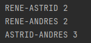
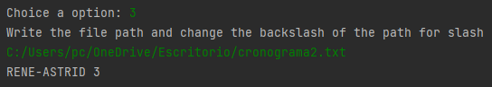
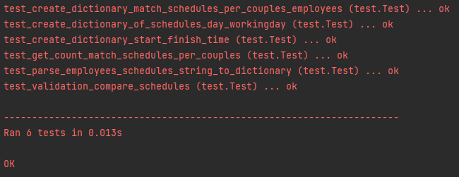

#Ioet Exercise Problem
##Problematic: 
The company ACME offers their employees the flexibility to work the hours they want. But due to some external circumstances they need to know what employees have been at the office within the same time frame.

##Objetive
Get the time that the couples employees have matching scheduling.

##Resources
1. A computer.
2. An IDE to execute python programs(pycharm or Visual Studio code with her dependencys) or have install python 3 in your operative system.

##Instructions how to run the program locally.
1. For Windows execute the command 
```python
   python <project-path>/main.py
```
##Solution

###Description
The program shows a menu with four options which three are 
responsible for file reading because there are two examples 
of preloaded schedules, but the user can specify the file 
path of other schedules too, then the output the program shows 
the times when two employees coincided in their schedule, and 
the fourth option is for testing execute to check the correct functionality of the 
function and methods that are used. 
1. Option 1


2. Option 2
   


3. Option 3


###Project Structure
The project have 3 files where the ***main*** file is for 
showing the menu that contains the main code of the program, 
the ***function*** file abstracts the functions and methods 
to get the differents components that are required for the 
correct functionality of the project, and the last file is 
***testing*** that check the correct functionality of the 
functions and methods defined in the functions file.

###Approach and methodology
The approach applied to solve the problem was to use the 
divide and conquer strategy for the functional programming 
which was used to separate different task in order to make
the code more readable and more understandable.

###Unit test
For the testing part was used the library ***Unittest*** 
that is installed for default when we install python in our
operative system.


###Algorithm complexity
The algorithm complexity final is O(n2*m) where n is the
amount of employee and m is amount of working day.